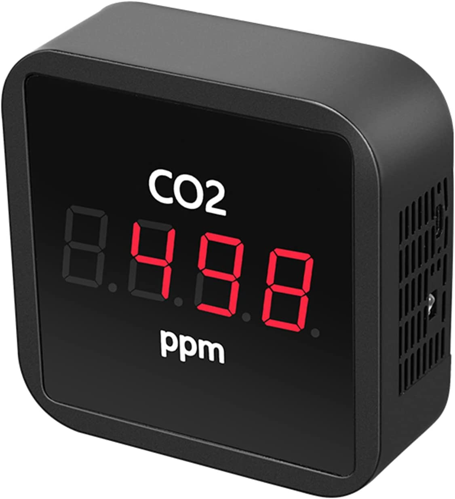
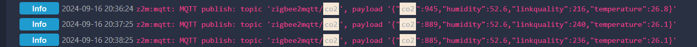
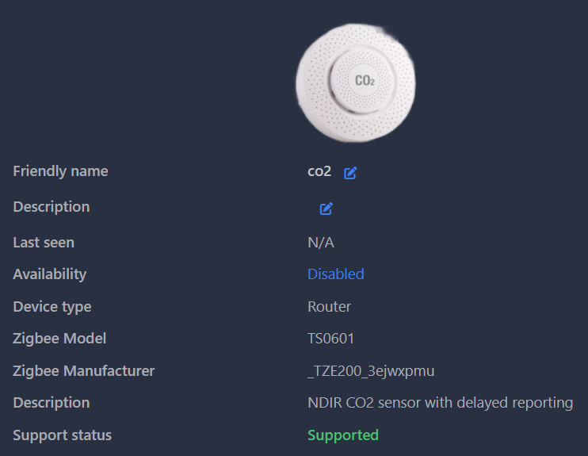

# TS0601 CO2 Sensor (_TZE200_3ejwxpmu)
NDIR CO2 sensor with delayed reporting. 




I found similar solution made by @schauveau to solve same issue for Tuya Air Filter.
Default time is 60 seconds. If you want to change it, edit the file and change "PUBLISH_DELAY"
````text
PUBLISH_DELAY = 60.0;
````
Result:



## HOW TO INSTALL:
- Drop the file `TS0601_CO2.js` in `external_converters` directory in Zigbee2MQTT folder (`>\config\zigbee2mqtt\external_converters`)
- Add the external converter either via Z2M web frontend or in configuration.yaml
- Restart Zigbee2MQTT
- If the device description now read `NDIR CO2 sensor with delayed reporting` then the external converter was successully loaded.


